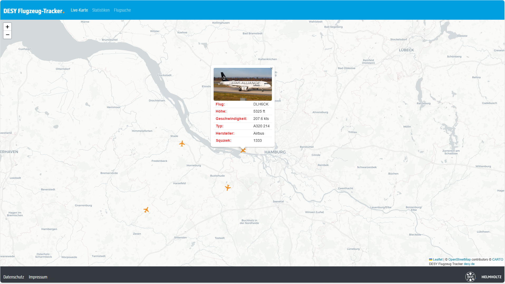
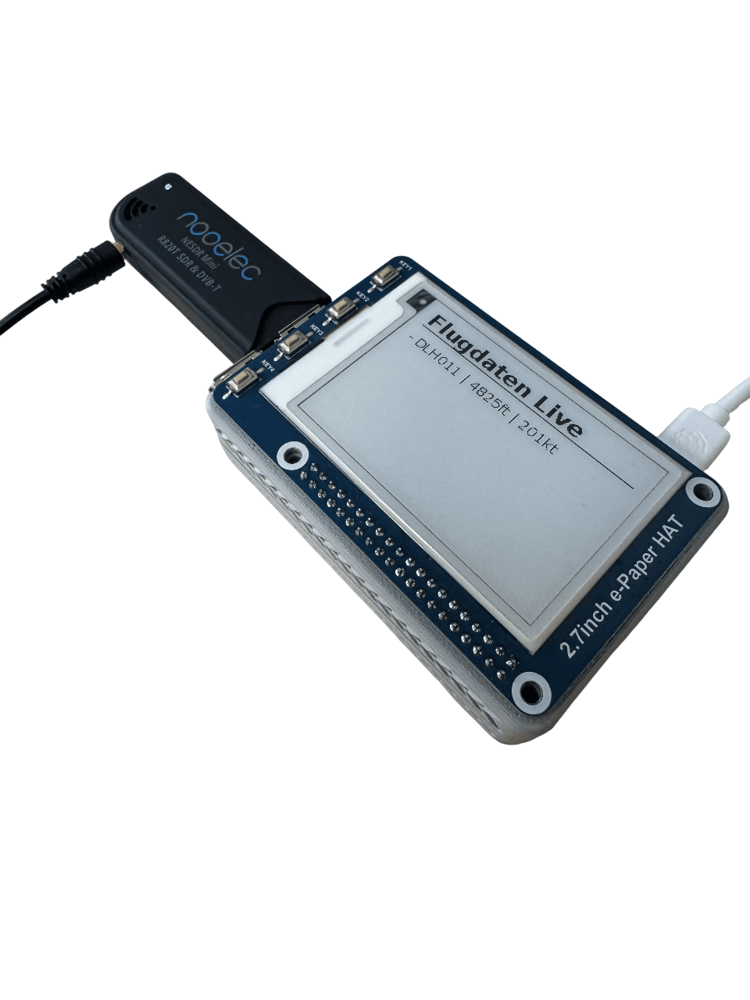
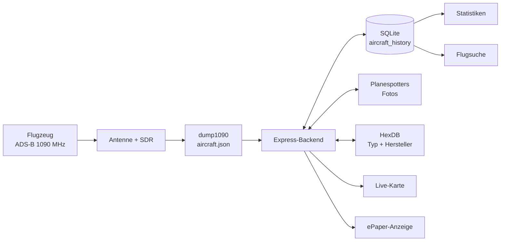

# DESY ADS-B Flugzeug-Tracker

Lokaler Flugzeug-Tracker für Live-Darstellung, Historisierung und Auswertung von ADS-B-Daten aus einer bestehenden dump1090-Installation. Ein Node.js-/Express-Backend liest den JSON-Feed, ergänzt Flugzeugfotos und Stammdaten, speichert Sichtungen in SQLite und stellt eine Weboberfläche mit Live-Karte, Statistiken und historischer Flugsuche bereit.



## Inhalt

- [Funktionsumfang](#funktionsumfang)
- [ADS-B und Hardware](#ads-b-und-hardware)
- [Architektur und Datenfluss](#architektur-und-datenfluss)
- [Installation und Konfiguration](#installation-und-konfiguration)
- [Bedienung](#bedienung)
- [API](#api)
- [Datenbank und Datenfelder](#datenbank-und-datenfelder)
- [ePaper-Anzeige](#epaper-anzeige)
- [Betrieb, Backup und Fehlerbehebung](#betrieb-backup-und-fehlerbehebung)
- [Projektstruktur](#projektstruktur)
- [Grenzen und mögliche Erweiterungen](#grenzen-und-mögliche-erweiterungen)

## Funktionsumfang

- Live-Karte mit Flugzeugposition, Flugrichtung und automatischer Aktualisierung im Sekundentakt
- Popups mit Callsign, Höhe, Geschwindigkeit, Typ, Hersteller, Squawk und optionalem Foto
- Historische Speicherung der Sichtungen in einer lokalen SQLite-Datenbank
- Deduplizierung pro ICAO-HEX-Adresse und konfigurierbarem Zeitfenster
- Statistiken zu eindeutigen Flugzeugen, häufigen HEX-Adressen, Höhen, Geschwindigkeiten, Flugzeugtypen, Herstellern und Sichtungen pro Stunde
- Exakte Suche nach Callsign/Flugnummer und Datum mit Kartenroute und Messpunkttabelle
- Metadaten-Cache, damit bekannte Fotos, Typen und Hersteller nicht zwischen Aktualisierungen verschwinden
- Reduzierter Live-Endpunkt für ein Waveshare-2,7-Zoll-ePaper-Display am Raspberry Pi

## ADS-B und Hardware

ADS-B steht für **Automatic Dependent Surveillance – Broadcast**. Flugzeuge bestimmen ihre Position in der Regel über GNSS/GPS und senden Identitäts- und Bewegungsdaten automatisch und ungerichtet aus. Für Verkehrsflugzeuge wird überwiegend 1090 MHz mit Mode S Extended Squitter (1090ES) verwendet. Die Meldungen sind nicht verschlüsselt und nicht in jedem Empfangszyklus vollständig.

Die typische Empfangskette besteht aus:

1. einer für 1090 MHz geeigneten Antenne,
2. einem SDR-Empfänger, beispielsweise einem RTL-SDR,
3. einem Raspberry Pi oder Linux-Rechner,
4. dump1090 zur Demodulation und Decodierung,
5. diesem Projekt zur Speicherung, Anreicherung und Darstellung.

dump1090 selbst ist **nicht** Bestandteil dieses Repositorys. Es muss bereits laufen und einen JSON-Endpunkt bereitstellen, dessen Antwort ein `aircraft`-Array enthält.

Das Projekt wurde zusätzlich mit einem Raspberry Pi, einem SDR-Stick und einem Waveshare-2,7-Zoll-ePaper-HAT erprobt. Die Projektdokumentation beschreibt außerdem ein 3D-gedrucktes PETG-Gehäuse; Druckdateien sind im Repository jedoch nicht enthalten.

<p align="center">
  
</p>

## Architektur und Datenfluss



Der Live-Datenfluss läuft wie folgt:

1. `public/assets/js/script.js` ruft jede Sekunde `GET /api/aircraft` auf.
2. Das Backend lädt die aktuelle dump1090-Antwort über die in `config.json` gesetzte `apiUrl`.
3. Bereits bekannte Metadaten werden aus SQLite in einen In-Memory-Cache geladen und auf die Live-Daten angewendet.
4. Das Backend sendet die Antwort sofort an den Browser.
5. Danach laufen Deduplizierung, fehlende externe Anreicherung und Speicherung asynchron weiter.
6. Leaflet erstellt oder aktualisiert die Marker und entfernt nicht mehr sichtbare Flugzeuge.

Wichtig: Es gibt keinen unabhängigen Sammelprozess. Neue historische Datensätze entstehen nur, wenn `/api/aircraft` aufgerufen wird – im Normalbetrieb geschieht das durch die geöffnete Live-Karte.

### Datenanreicherung

Für eine neue oder noch unvollständige ICAO-HEX-Adresse fragt der Server optional folgende Dienste ab:

| Dienst        | Zweck                             | Timeout im Code |
| ------------- | --------------------------------- | --------------: |
| Planespotters | Flugzeugfoto über die HEX-Adresse |     30 Sekunden |
| HexDB         | Flugzeugtyp und Hersteller        |      3 Sekunden |

Fehler dieser Dienste werden protokolliert, verhindern aber weder die Live-Antwort noch die Speicherung der verfügbaren ADS-B-Daten. Bei einem erstmals gesehenen Flugzeug können Zusatzdaten deshalb erst in einem späteren Aktualisierungszyklus erscheinen.

## Installation und Konfiguration

### Voraussetzungen

- Node.js mit npm; eine aktuelle LTS-Version wird empfohlen
- erreichbarer dump1090-kompatibler JSON-Feed
- Schreibrechte für das Datenbankverzeichnis
- für die vollständige Weboberfläche Internetzugriff auf CDN-, Karten- und Anreicherungsdienste

### Installation

```bash
git clone https://github.com/FlosTechnikwelt/adsb-dump1090.git
cd adsb-dump1090
npm install
```

Anschließend `config.json` an die eigene Umgebung anpassen:

```json
{
  "apiUrl": "http://127.0.0.1:8080/data/aircraft.json",
  "positionSaveIntervalSeconds": 5,
  "port": "3001",
  "listenon": "0.0.0.0",
  "prefixdb": "[DESY-ADSB DATABASE]: ",
  "prefixexpress": "[DESY-ADSB WEBSERVE]: ",
  "prefixconfig": "[DESY-ADSB CONFIG]: "
}
```

| Einstellung                                 | Bedeutung                                                                                                    |
| ------------------------------------------- | ------------------------------------------------------------------------------------------------------------ |
| `apiUrl`                                    | Vollständige URL des dump1090-JSON-Feeds; für Live-Daten erforderlich                                        |
| `positionSaveIntervalSeconds`               | Mindestabstand zwischen zwei Speicherungen derselben HEX-Adresse                                             |
| `dedupeSeconds`                             | Älterer Alternativname für das Speicherintervall; wird nur genutzt, wenn `positionSaveIntervalSeconds` fehlt |
| `port`                                      | HTTP-Port des Express-Servers                                                                                |
| `listenon`                                  | Bind-Adresse; `0.0.0.0` macht den Dienst im erreichbaren Netzwerk verfügbar                                  |
| `dbPath`                                    | Optionaler SQLite-Pfad; wird von `DB_PATH` übersteuert                                                       |
| `prefixdb`, `prefixexpress`, `prefixconfig` | Präfixe für Konsolenausgaben                                                                                 |

Wenn kein Speicherintervall gesetzt ist, verwendet der Code 5 Sekunden. Die mitgelieferte Konfiguration setzt aktuell 1 Sekunde und erzeugt entsprechend mehr Datenbankeinträge.

Der Datenbankpfad kann ohne Änderung der Konfigurationsdatei überschrieben werden:

```bash
DB_PATH=/var/lib/desy-adsb/stats.db npm start
```

Das Zielverzeichnis muss für den ausführenden Benutzer beschreibbar sein.

### Start

Normalbetrieb:

```bash
npm start
```

Entwicklungsbetrieb mit automatischem Neustart:

```bash
npm run start:dev
```

Beim Start prüft `database.js` Verzeichnis und Datenbankdatei, legt beides bei Bedarf an, führt `CREATE TABLE IF NOT EXISTS` aus und startet den Webserver erst nach erfolgreicher Initialisierung.

## Bedienung

Bei der Standardkonfiguration sind folgende Seiten verfügbar:

| Ansicht     | URL                                     | Aktualisierung        |
| ----------- | --------------------------------------- | --------------------- |
| Live-Karte  | `http://localhost:3001/`                | jede Sekunde          |
| Statistiken | `http://localhost:3001/statistics.html` | alle 10 Sekunden      |
| Flugsuche   | `http://localhost:3001/search`          | bei Formularabsendung |

Die Live-Karte startet mit einem Kartenausschnitt um DESY in Hamburg. Für Marker werden nur Datensätze mit `lat` und `lon` verwendet. Höhe und Geschwindigkeit erscheinen primär in Fuß beziehungsweise Knoten; Tooltips zeigen zusätzlich Meter und km/h.

Umrechnungen:

| Ausgangswert | Umrechnung | Beispiel            |
| ------------ | ---------- | ------------------- |
| 1 ft         | 0,3048 m   | 10.000 ft = 3.048 m |
| 1 kt         | 1,852 km/h | 250 kt = 463 km/h   |

Die Flugsuche erwartet das exakte, von dump1090 gelieferte Callsign ohne führende oder nachgestellte Leerzeichen sowie ein Datum im Format `YYYY-MM-DD`.

## API

| Methode und Pfad                              | Beschreibung                                                                    | Erfolgsantwort                          |
| --------------------------------------------- | ------------------------------------------------------------------------------- | --------------------------------------- |
| `GET /api/aircraft`                           | Lädt den dump1090-Feed, ergänzt bekannte Metadaten und stößt die Speicherung an | dump1090-Objekt mit `aircraft`-Array    |
| `GET /api/aircraft/current`                   | Reduzierte Live-Liste für kleine Anzeigen                                       | Array aus `flight`, `altitude`, `speed` |
| `GET /api/statistics`                         | Aggregierte Werte aus `aircraft_history`                                        | Statistikobjekt                         |
| `GET /api/flights/search?flight=...&date=...` | Exakte historische Suche nach Callsign und Datum                                | chronologisch sortiertes Array          |

### Beispiele

```bash
curl http://localhost:3001/api/aircraft/current
curl http://localhost:3001/api/statistics
curl "http://localhost:3001/api/flights/search?flight=DLH2LC&date=2026-02-19"
```

Vereinfachte Antwort von `/api/aircraft/current`:

```json
[
  {
    "flight": "DLH2LC ",
    "altitude": 11800,
    "speed": 228.4
  }
]
```

`/api/statistics` liefert:

- `uniqueAircraft`: Anzahl unterschiedlicher HEX-Adressen
- `topAircraft`: fünf HEX-Adressen mit den meisten gespeicherten Sichtungen
- `averages`: Durchschnitt von Höhe und Geschwindigkeit für positive Werte
- `sightingsPerHour`: Anzahl der Datensätze pro Stunde
- `aircraftTypes`: Sichtungen je bekanntem Typ
- `topManufacturers`: fünf Hersteller mit den meisten Sichtungen

Fehlen bei der Flugsuche `flight` oder `date`, antwortet der Server mit HTTP 400. Fehler beim Feed oder bei Datenbankabfragen führen zu HTTP 500.

## Datenbank und Datenfelder

SQLite speichert standardmäßig in `stats.db`. Die einzige Anwendungstabelle heißt `aircraft_history`; jeder Datensatz entspricht einer gespeicherten Sichtung.

| Spalte         | Typ           | Quelle/Bedeutung                                    |
| -------------- | ------------- | --------------------------------------------------- |
| `id`           | INTEGER       | automatisch hochgezählter Primärschlüssel           |
| `hex`          | TEXT, Pflicht | 24-Bit-ICAO-Adresse in Hexadezimaldarstellung       |
| `flight`       | TEXT          | Callsign beziehungsweise Flugnummer                 |
| `alt_baro`     | INTEGER       | barometrische Höhe in Fuß                           |
| `gs`           | REAL          | Geschwindigkeit über Grund in Knoten                |
| `track`        | REAL          | Kurs über Grund in Grad                             |
| `lat`, `lon`   | REAL          | geografische Position in Dezimalgrad                |
| `squawk`       | TEXT          | vierstelliger Transpondercode                       |
| `type`         | TEXT          | Flugzeugtyp aus Feed oder HexDB                     |
| `manufacturer` | TEXT          | Hersteller aus Feed oder HexDB                      |
| `photo_url`    | TEXT          | Bild-URL von Planespotters                          |
| `timestamp`    | DATETIME      | SQLite-Zeitpunkt, standardmäßig `CURRENT_TIMESTAMP` |

dump1090 kann deutlich mehr Felder liefern. Dazu gehören unter anderem `now`, `messages`, `alt_geom`, `ias`, `tas`, `mach`, `track_rate`, `roll`, `mag_heading`, `baro_rate`, `geom_rate`, `emergency`, `category`, `nav_qnh`, `nav_altitude_mcp`, `nic`, `rc`, `seen_pos`, `version`, `nic_baro`, `nac_p`, `nac_v`, `sil`, `sil_type`, `gva`, `sda`, `mlat`, `tisb`, `seen` und `rssi`. Sie werden mit der Live-Antwort weitergegeben, aber derzeit nicht in `aircraft_history` gespeichert.

Die Deduplizierung wird pro Prozess in einer `Map` geführt und nach einem Neustart zurückgesetzt. Es gibt derzeit keine automatische Aufbewahrungsfrist; häufiges Polling lässt die Datenbank kontinuierlich wachsen.

## ePaper-Anzeige

[`pi-display/python-script.py`](pi-display/python-script.py) zeigt bis zu fünf aktuelle Flugzeuge auf einem Waveshare-2,7-Zoll-ePaper-HAT V2. Angezeigt werden Callsign, Höhe und Geschwindigkeit; bei einem API-Fehler erscheint `404 Not found`. Das Display wird um 90 Grad gedreht und alle 10 Sekunden aktualisiert.

Zusätzliche Python-/Hardware-Abhängigkeiten:

- `requests`
- Pillow (`PIL`)
- Waveshare-ePaper-Bibliothek mit `waveshare_epd.epd2in7_V2`
- DejaVu Sans unter `/usr/share/fonts/truetype/dejavu/`

Beispielstart auf dem Raspberry Pi, nachdem die Herstellerbibliothek eingerichtet wurde:

```bash
python3 -m pip install requests Pillow
python3 pi-display/python-script.py
```

Das Skript erwartet den Webserver unter `http://127.0.0.1:3001`. Bei getrennter Hardware muss die Konstante `URL` im Skript angepasst werden.

## Betrieb, Backup und Fehlerbehebung

### Datenbank sichern

Für ein konsistentes Backup im laufenden Betrieb kann die SQLite-Backup-Funktion verwendet werden:

```bash
mkdir -p backups
sqlite3 stats.db ".backup 'backups/stats.db'"
```

Zusätzlich sollten `config.json` und der Quellcode gesichert werden. Das Repository enthält keine automatische Rotation, Archivierung oder Wiederherstellung.

### Keine Flugzeuge auf der Karte

1. `apiUrl` direkt prüfen: `curl http://HOST:PORT/data/aircraft.json`.
2. Sicherstellen, dass die Antwort ein `aircraft`-Array enthält.
3. Serverprotokoll auf Timeout- oder Verbindungsfehler prüfen.
4. Für Marker müssen `hex`, `lat` und `lon` vorhanden sein.

### Statistiken oder Suche bleiben leer

Historie entsteht erst durch Aufrufe von `/api/aircraft`. Zuerst die Live-Karte eine Zeit lang geöffnet lassen oder den Endpunkt regelmäßig abrufen. Die Suche gleicht das bereinigte Callsign exakt ab.

### `SQLITE_READONLY: attempt to write a readonly database`

- Server nicht abwechselnd mit und ohne `sudo` starten.
- Eigentümer und Schreibrechte von Datenbank **und** übergeordnetem Verzeichnis prüfen.
- Alternativ `DB_PATH` auf ein beschreibbares Datenverzeichnis setzen.

Der Code prüft die Rechte bereits vor dem Start und versucht für eine vorhandene Datenbankdatei den Modus `0664` zu setzen. Schlägt das fehl, beendet sich der Server mit einer konkreten Pfadangabe.

### Fotos fehlen oder erscheinen verzögert

Nicht jede HEX-Adresse besitzt ein Foto bei Planespotters. Bei neuen Flugzeugen erfolgt die externe Anfrage erst nach der Live-Antwort; ein erfolgreich geladenes Foto wird in späteren Antworten aus Cache oder Datenbank ergänzt.

### Kartenlayout oder Kartenkacheln fehlen

Bootstrap, Leaflet, das Rotated-Marker-Plugin und CARTO-Kacheln werden extern geladen. Ohne Internetzugriff funktionieren Backend, SQLite und lokale APIs, die Webansicht ist jedoch nur eingeschränkt nutzbar.

## Projektstruktur

```text
.
├── server.js                    # Express-Server, APIs, Cache und Persistenz
├── database.js                  # SQLite-Pfadprüfung und Initialisierung
├── config.json                  # Laufzeitkonfiguration
├── stats.db                     # SQLite-Datenbank
├── package.json                 # npm-Skripte und Abhängigkeiten
├── public/
│   ├── index.html               # Live-Karte
│   ├── statistics.html          # Statistik-Dashboard
│   ├── search.html              # Historische Flugsuche
│   └── assets/                  # CSS, Browser-JavaScript, Fonts, Logos, Favicons
├── pi-display/
│   └── python-script.py         # Waveshare-ePaper-Client
├── doku/
│   ├── *.md / *.odt             # Vertiefende Projekt- und Problemdokumentation
│   ├── presentation.html        # Browser-Präsentation
│   └── images/                  # Die zwei in dieser README verwendeten Projektbilder
└── adsb-pp.pptx                 # Projektpräsentation
```

Vertiefende Dokumente behandeln insbesondere die SQLite-Schreibrechte, die stabile Metadatenanzeige und die Entwicklungsgeschichte. Bei Abweichungen ist der aktuelle Quellcode maßgeblich; diese README fasst den geprüften Ist-Stand zusammen.

## Entwicklung

Verfügbare npm-Skripte:

```bash
npm start              # Server starten
npm run start:dev      # mit nodemon starten
npm run format         # Dateien mit Prettier formatieren
npm run format:check   # Formatierung nur prüfen
```

Im Repository sind aktuell keine automatisierten Unit- oder Integrationstests eingerichtet.

## Grenzen und mögliche Erweiterungen

- Keine Authentifizierung, Autorisierung oder Rate-Begrenzung: nicht ungeschützt ins öffentliche Internet stellen.
- SQLite besitzt aktuell keine zusätzlichen Indizes auf `hex`, `flight` oder `timestamp`.
- Keine Retention, Archivierung oder Größenbegrenzung für historische Daten.
- Externe Dienste und CDN-Ressourcen können ausfallen oder Anfragen begrenzen.
- ADS-B ist offen ausgestrahlt und nicht authentifiziert; die Anwendung ist kein System für sicherheitskritische Entscheidungen.
- Die Flugsuche arbeitet mit exaktem Callsign und Datum, ohne Teiltextsuche oder Zeitzonenauswahl.
- Mögliche nächste Schritte: Tests, Eingabevalidierung, Rate-Limiting, Hintergrundsammler, Datenexport, Indizes, Monitoring, Retry/Backoff und bei höherer Last PostgreSQL.

## Technologien und Quellen

- Backend: Node.js, Express, Axios
- Datenbank: SQLite über `sqlite3`
- Frontend: HTML, CSS, JavaScript, Bootstrap, Leaflet, Chart.js und date-fns-Adapter
- Karten: OpenStreetMap-Daten und CARTO-Kacheln
- Metadaten: Planespotters und HexDB
- Hardwareanzeige: Pillow und Waveshare e-Paper

Projekt und Dokumentation: Florian Linde, DESY IT. In `package.json` ist die Lizenz als ISC angegeben.
